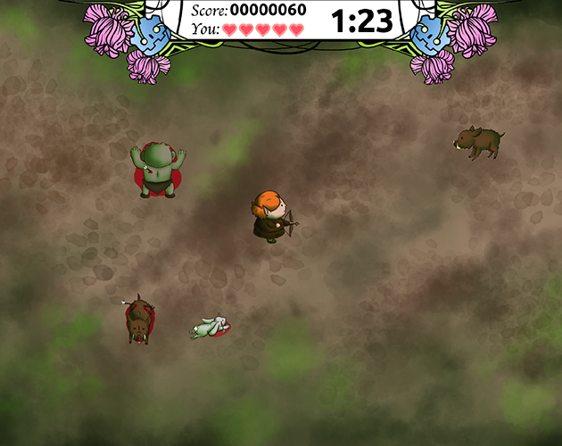

# Elf Hunting

Ability game about an elf called Alex shooting down creatures and combining them for powerups.

## Mechanics

- Shoot down all the creatures possible before the time runs out.
- Combine 2 different hunted creatures between them for combining them into a food.
- Eat the food for a powerup. Be carefoul! Not all combinations are good! 

### Controls

- A, S, D, W: Movement
- Movimiento del ratón: Aim
- Click izquierdo: Shoot and grab / drop dead creatures.

# Créditos

## Design

- Moises.J Bonilla Caraballo
- Yaiza Bonilla Fernández
- Oscar Lindenborn Bordona

## Programming

- Moises.J Bonilla Caraballo

## Concept art

- Yaiza Bonilla Fernández

## Graphic design

- Oscar Lindenborn Bordona

## Ambient music

- Joan Pons

## Sound FX

- Keyli Castro valdes

## Third party work and software

### Software

- Godot Engine
- Adobe Photoshop

### Original soundtrack from FreeSounds

- cheira - 020 Grito de mujer-glued.wav
- ecfike - Dude Pack » Ugh! 2.wav
- Deathscyp - Deathscyp Factory » Damage-1.wav
- EverHeat - Sound Effects » Backpack1.wav
- Chewing - Breadstick » Chewing, Breadstick, Single, C.wav
